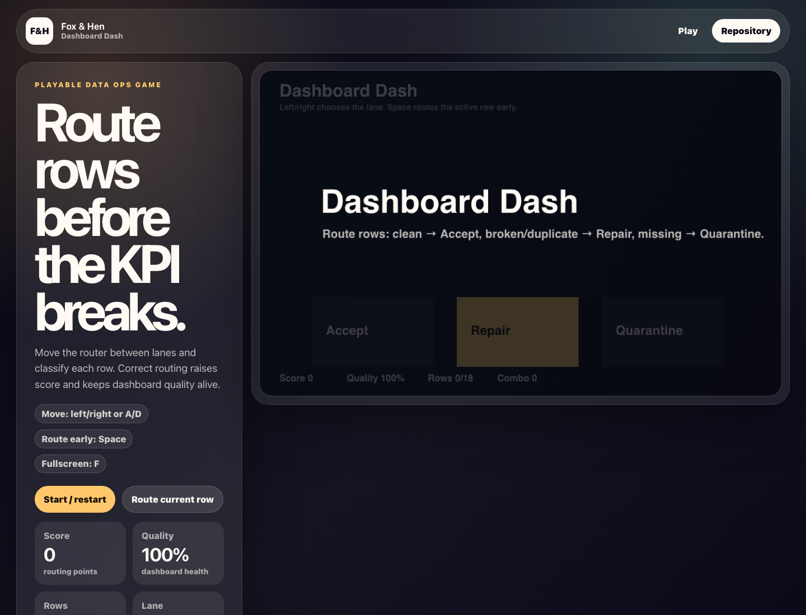

# Dashboard Dash

A playable data-routing arcade game for clean rows, repairs, and quarantine decisions.



## Live Demo

- Demo: [https://foxhen-dashboard-dash.vercel.app](https://foxhen-dashboard-dash.vercel.app)
- Repository: [https://github.com/foxandhenllc/foxhen-dashboard-dash](https://github.com/foxandhenllc/foxhen-dashboard-dash)

## Fully Working Behaviors

- Playable local state with scoring and success/failure conditions.
- Keyboard or click controls documented in the interface.
- Deterministic test hooks exposed as `window.render_game_to_text` and `window.advanceTime`.
- No backend, auth, external service calls, production data, or customer work.

## Local Run

```bash
npm install
npm run dev
npm run build
```
